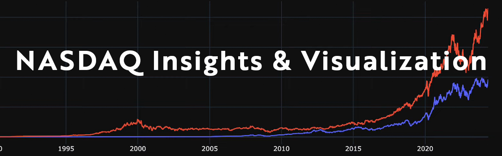
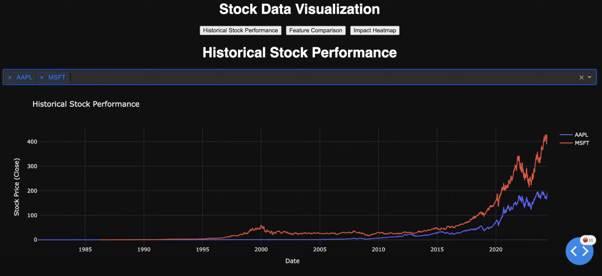
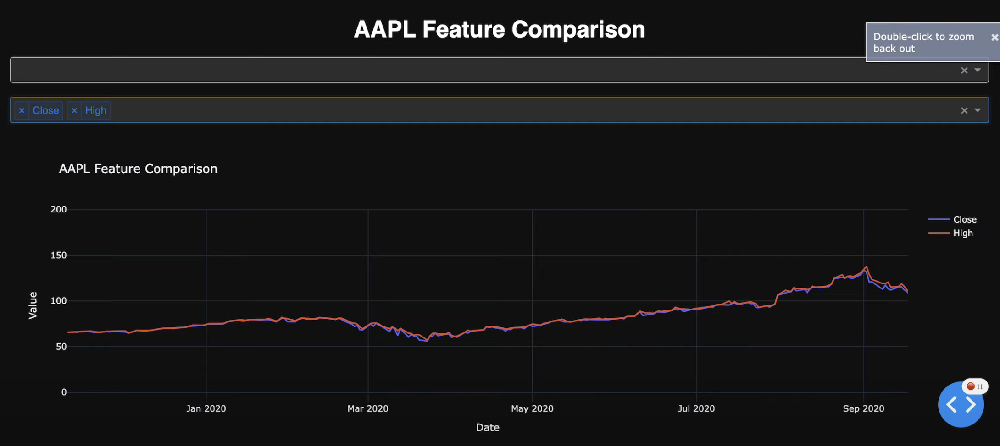
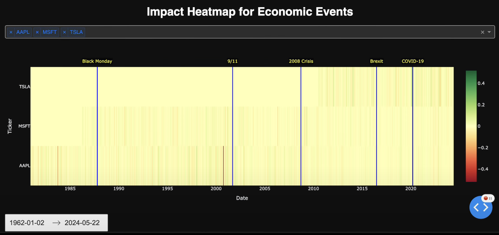
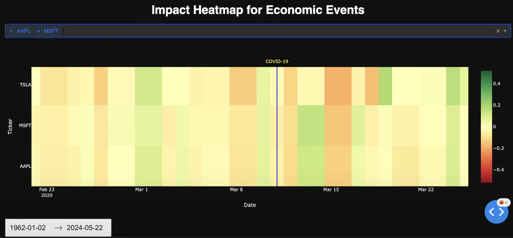

## Overview

This project presents an interactive platform for visualizing NASDAQ stock data from 1963 to 2024. Leveraging Python, Plotly, and Pandas, the application offers users a modular and user-friendly interface to explore historical stock trends, perform data analysis, and gain insights into market behaviors.

## Features

- **Interactive Visualizations**: Engage with dynamic charts that allow zooming, panning, and hover functionalities for detailed data inspection.
- **Comprehensive Data Coverage**: Access extensive NASDAQ stock data spanning from 1963 to 2024.
- **Data Cleaning and Feature Extraction**: Utilize Pandas for efficient data preprocessing, ensuring accurate and insightful visual representations.
- **Modular Design**: Experience a flexible architecture that facilitates easy updates and integration of additional features.

## Visualizations

The project includes three key visualization tools:

1. **Stock Prices Over Time Comparison Chart**: Displays the closing prices of selected stocks across the specified date range for comparison between selected stocks.
   
   

2. **Stock Feature Chart**: Illustrates the relationship between a stocks features such as open price, close price, trade volume, high, and low.
   
   

3. **Moving Average Convergence Divergence (MACD)**: Provides insights into stock momentum and robustness, conveying how a stock performs in varying economic conditions such as the 2008 market crash, or the COVID-19 pandemic.
   
   
   

## Video Demo

